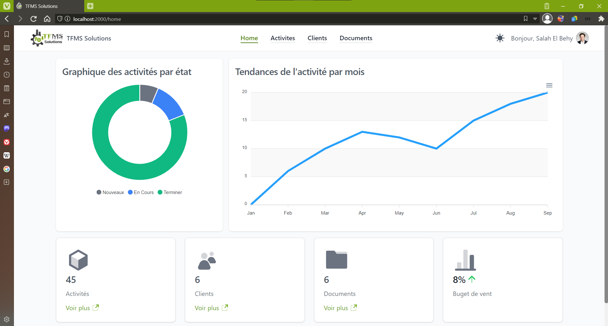
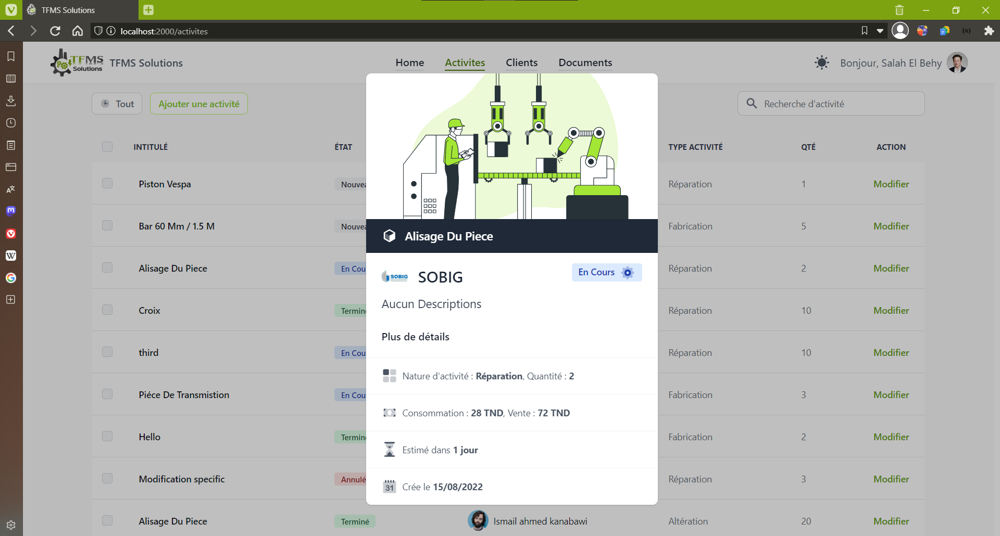
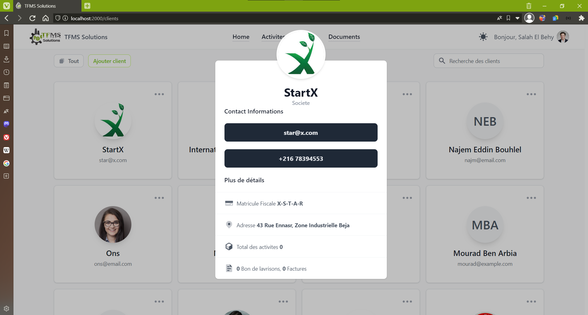
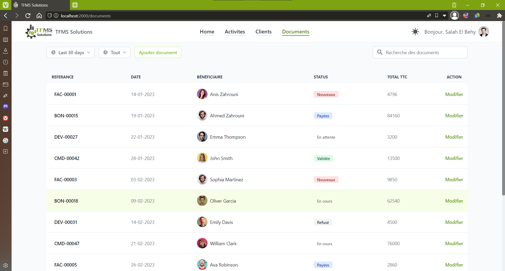

# TFMS Solutions

<p align="center">
  <a href="#about-the-project">About The Project</a> •
  <a href="#installation">Installation</a> •
  <a href="#modules">Modules</a> •
  <a href="#how-to-use">How To Use</a> •
  <a href="#license">License</a>
</p>

## About The Project

The project is a web application designed for enterprise management. It focuses on managing manufacturing activities, including handling invoices and clients. The website provides a user-friendly interface and features that streamline the process of managing manufacturing operations within the enterprise. It aims to enhance efficiency, organization, and coordination in handling various manufacturing tasks, such as tracking invoices, managing customer information, and overseeing manufacturing activities.

## Screenshots

### Home



_Description: This is the landing page after login where users can see a statics of data and access various modules._

### Activities



_Description: This section allows users to manage and track manufacturing activities, providing insights and acitivty's related informations._

### Clients



_Description: In the Clients module, users can add, edit, and manage client information, as well as track client interactions._

### Documents



_Description: The Documents section enables users to store and organize important files and documents related to manufacturing and clients._

### Build with

[](https://reactjs.org/)
[](https://nodejs.org/en/)
[](https://www.mongodb.com/)

### Host Platform

[](https://vercel.com/dashboard)

### Development Environment

[](https://code.visualstudio.com/)

### Link to website

> [tfms-solutions.vercel.app](https://tfms-solutions.vercel.app)

### Link to API repositories

> [github.com/hassenmaoua/tfms-API](https://github.com/hassenmaoua/tfms-API)

## Installation

To clone and run this application, you'll need [Git](https://git-scm.com) and [React.js](https://react-cn.github.io/react/downloads.html) (which comes with [npm](http://npmjs.com)) installed on your computer.

From your command line:

- Clone this repository

```bash
git clone https://github.com/hassenmaoua/tfms-solutions
```

- Go into the repository

```bash
cd tfms-solutions
```

- Install Dependencies and `node_modules`

```bash
npm install
```

- Configure the database settings inside `.env`

```js
PORT = 4000;
REACT_APP_API_URL = 'http://localhost:3000/api';
REACT_APP_API_PUBLIC_URL = 'http://localhost:3000';
```

- Run developement server

```bash
npm start
```

## Modules

> `tailwindcss` : [Tailwindcss](https://tailwindcss.com/) is enterprise-class UI design language and React UI library with a set of high-quality React components, one of best React UI library for enterprises.

> `apexcharts` : [ApexCharts](https://apexcharts.com/docs/react-charts/) providing an easy way to create interactive and visually appealing charts in React applications using declarative syntax.

> `axios` : [Axios](https://axios-http.com/docs/intro) is a promised-based HTTP client for JavaScript. It has the ability to make HTTP requests from the browser and handle the transformation of request and response data.

> `react-query` : [React Query](https://tanstack.com/query/v3/docs/react/overview) is a powerful library for managing and caching asynchronous data in React applications. It simplifies the process of fetching, updating, and synchronizing data with server APIs, providing a seamless and efficient data-fetching experience.

> `formik` : [Formik](https://formik.org/docs/overview) is a popular library for managing forms in React applications, simplifying form state management, validation, and submission handling.

## How To Use

You may run this simple steps after visit [TFMS Solutions](https://tfms-solutions.vercel.app/) or use local running.

1. When the website is opened, the user is required to authenticate. You can register and then authenticate to create entities within application to see demonstration.

2. The user would have access to the manifactures activities for which he is responsible, to customers and invoices of his company.

3. It is possible to change, add and modify products, clients and invoices.

## License

#### Hassen Maoua - Gmail [hassenmaoua07@gmail.com](https://mail.google.com/mail/?view=cm&fs=1&to=hassenmaoua07@gmail.com&su=About+LMW+API)

---

> [](https://linkedin.com/in/hassen-maoua) &nbsp;&middot;&nbsp; [](https://github.com/hassenmaoua) &nbsp;&middot;&nbsp; [](https://facebook.com/hassen.maoua)
